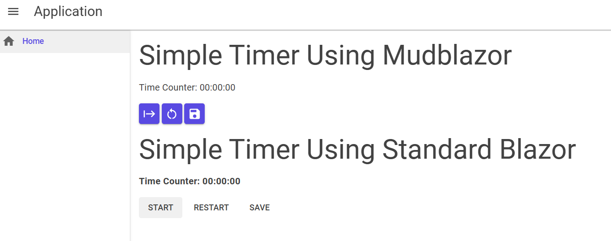

<h1 align="center">Time Component</h1> 
The scope of this project was to create a component for tracking time using standard Blazor and MudBlazor.
  

# Component's
1. Blazor_TimeCounter
1. MudBlaz_TimerCounter

# Usage
Both component's have 3 buttons and an EventCallback OnSave

The buttons are from left to right:

1. Start/Stop/Play/Pause => Starts a TimeSpan or Pauses it if it is running
1. Reset => Sets the timer back to 0
1. Save => This triggers the EventCallback, This returns a TimeSpan Object

# Bugs
1. Pausing/Stop will sometimes round up the number being displayed.